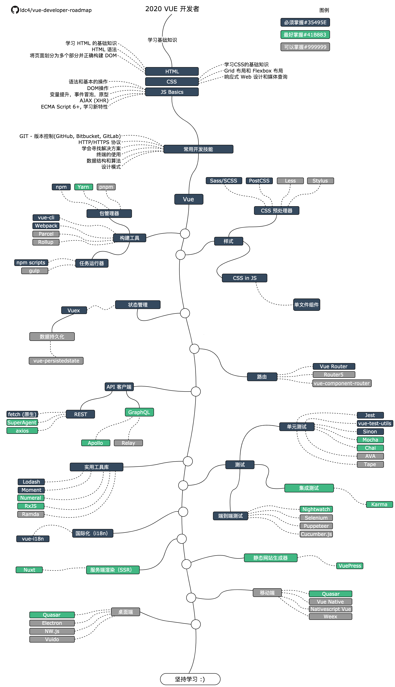

# 2020 VUE 开发者

参考：  
https://github.com/adam-golab/react-developer-roadmap  
https://github.com/marekbrainhub/vue-developer-roadmap  

以上面两个为模板，另行定制一个Vue学习线路图

仅做个人学习使用，请勿当成最佳实践。

欢迎讨论和提issue

**正在建设中...**

# 修改

采用draw.io进行修改

问题：
1. 打开乱码怎么办？  
不要通过初始的弹出窗口打开文件，进入到空白页，点击文件 -> 从...打开 -> GitHub 或者 电脑或手机设备...

2. 导出的图片很模糊怎么办？  
导出时将缩放调大，建议250%以上

## Roadmap

